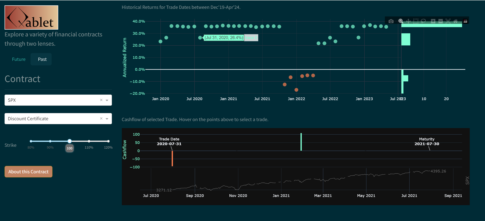
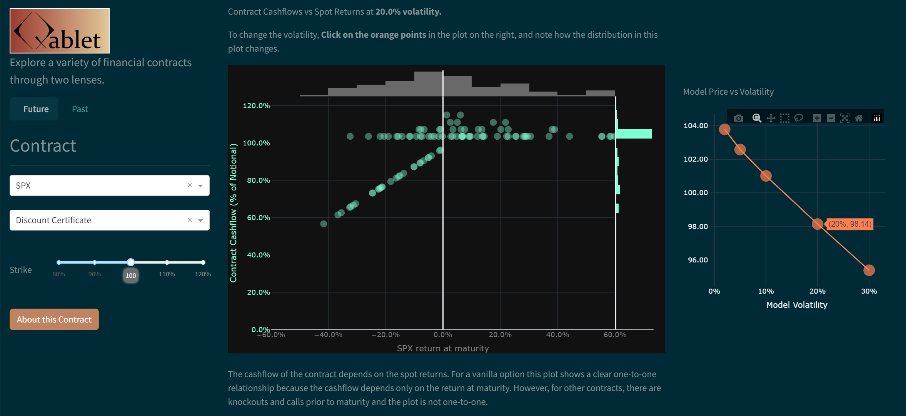

See the [application in action here](https://apps-dash.onrender.com/)

This application explores a variety of financial contracts through two lenses.

# Past
Historical returns for trade dates in a five year period.



# Future
Future returns projected by model.




To setup

```
py -3.11 -m venv .venv
.venv/Scripts/activate
pip install -e . --upgrade
```

To start locally (Windows)
```
python app.py
```

To deploy (Linux/Render)
```
gunicorn app:server
```